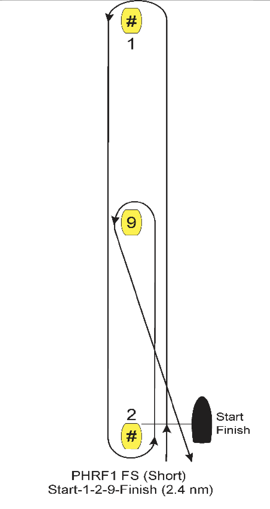

# SignalK Racing Calculator Plugin

This plugin provides a bare-bones set of racing related delta messages
that can be used for beer can racing around fixed marks. 
All you need is a SignalK server with a GPS receiver that can provide updates for
3 paths:
[navigation.position](https://signalk.org/specification/1.7.0/doc/vesselsBranch.html#vesselsregexpnavigationposition),
[navigation.courseOverGroundTrue](https://signalk.org/specification/1.7.0/doc/vesselsBranch.html#vesselsregexpnavigationcourseovergroundtrue), and
[navigation.speedOverGround](https://signalk.org/specification/1.7.0/doc/vesselsBranch.html#vesselsregexpnavigationspeedoverground).

Based on this information, the following paths wil be computed by this plugin:

| Path                                  | Units     | Module |
| ------------------------------------- | --------- | ------ |
| navigation.racing.timeToStart 	    | s         |  1     |
| navigation.racing.raceStatus 	        | enum      |  1     |
| navigation.racing.distanceBoatEnd 	| m         |  2     |
| navigation.racing.distancePinEnd  	| m         |  2     |
| navigation.racing.distanceStartline 	| m         |  2     |
| navigation.racing.distanceToMark 	    | m         |  3     |
| navigation.racing.bearingToMark       | rad       |  3     |
| navigation.racing.cogToMark 	        | rad       |  3     |
| navigation.racing.vmg 	            | m/s       |  3     |
| navigation.racing.vmgToMark 	        | m/s       |  3     |
| navigation.racing.markName 	        | string    |  3     |

The values of `.raceStatus` are as follows:
1. `setup` – race is being set up and no countdown has started yet
2. `pre-start` – race countdown is ongoing
3. `racing` – race countdown has finished and the race started

The computed paths are split by module and 
to turn each module on, it is necessary to send a PUT request to an API endpoint.
Each endpoint is described in detail in [API.json](./src/api.json#L159).

### Module 1: Racing timer 

Start the timer by sending a PUT request to [/startRaceCountdown](./src/api.json#L159) with 
the JSON containing the value of seconds to set the countdown to.
This will immediately begin the countdown in `timeToStart` and set the `raceStatus` to `pre-start`.

If the race start is postponed (AP flag) or there is a general recall,
the race countdown can be cancelled by sending a PUT request to [/cancelRace](./src/api.json#L192).
This will have the effect of resetting the `raceStatus` to `setup` and cancelling the timer.

### Module 2: Start line calculator

To mark the start line, send a PUT request to either [/pingBoat](./src/api.json#L205) or 
[/pingPin](./src/api.json#L218) when the boat passes by the corresponding mark.
There is no way to unset these pings except by pinging again which will have the effect of updating
the corresponding position.

### Module 3: Race course setup and navigation

This module requires the most configuration to be done ahead of time. 
First, add the fixed mark names and positions to the configuration of the plugin in SignalK admin interface.
Second, create named race courses: each course consists of a number of course legs, and
each leg is defined by a mark (from among the ones defined previously) and 
an upwind or downwind general direction.

Let's use this diagram of a windward-leeward course as an example. 
Make this course selectable in the plugin, you need:
1. Enter the GPS coordinates of marks numbered #1, #2, and #9 as fixed marks.
1. Add a race course consisting of 4 legs:
    1. Upwind leg to mark #1
    1. Downwind leg to mark #2
    1. Upwind leg to mark #9
    1. Downwind leg to mark #2

Once the above setup is complete, send a PUT request to [/selectCourse](./src/api.json#L231) with 
the JSON containing the string value equal to the name of the selected course.
As long as the race status is `setup` or `pre-start`, this will update the current course, 
set the first leg as the current one, and start computing all module 3 paths.
If the race status is already `racing`, this endpoint will return an error, so you should 
[/cancelRace](./src/api.json#L192) first, and only then select a new course.

Once the boat comes to within 30m of the mark position, the plugin will automatically advance 
the leg index to the next leg. You can modify far this happens in the plugin settings. 
Alternatively, you can manually advance through the race by sending a PUT request to
[/nextWaypoint](./src/api.json#L264): 
this works even if the race status is not `racing` and can be used to manually test your setup ahead of the race.

